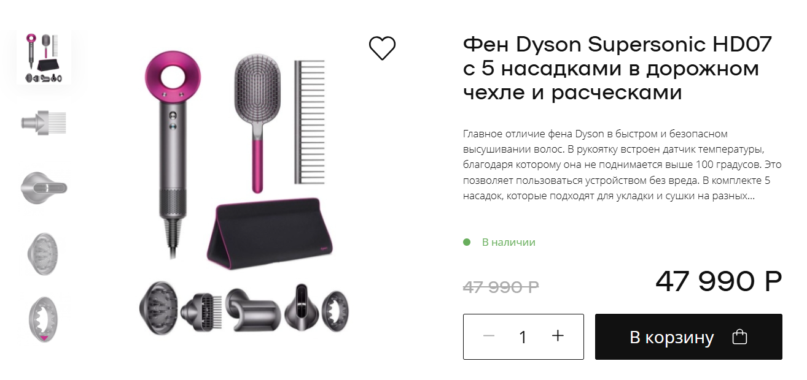

# Project Dyson

My HTML/CSS/JS Thesis Project (Module 2)

## The main thing is implemented:

* Mini dropdown menu
* Product card
* Sliders
* "Quantity" button
* "Add to card" button
* Like button
* Tab - controls
* FAQ - accordion
* Video section
* Product cards section
* "Similar" botton